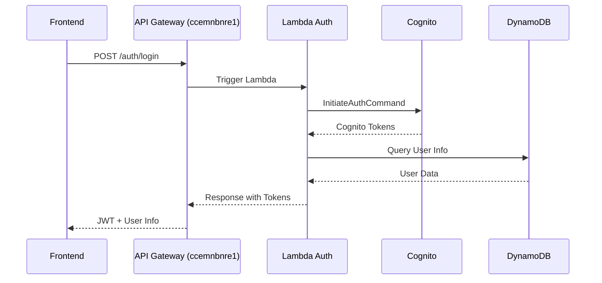
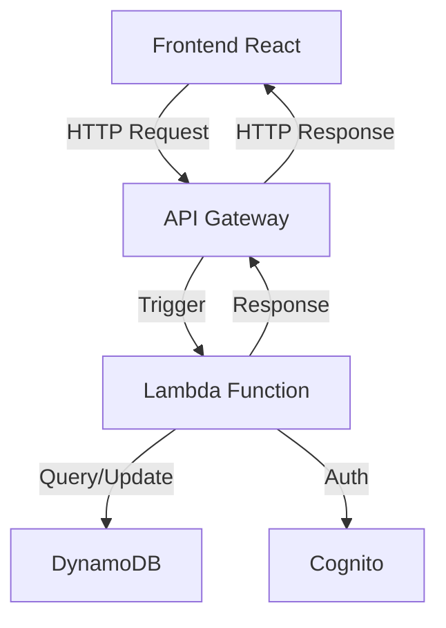
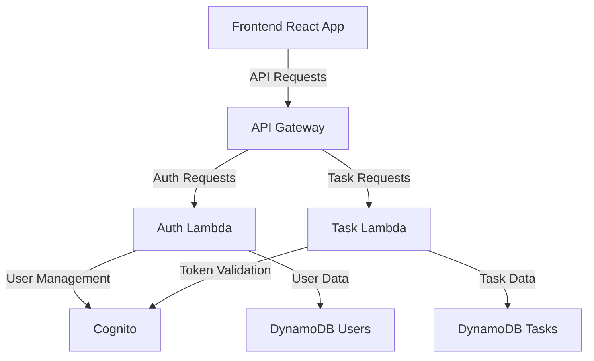

# Project Documentation: Task Management System - Microservices Architecture

## Table of Contents
1. [Project Overview](#project-overview)
2. [Documentation Overview](#documentation-overview)
3. [AWS and Serverless Architecture](#aws-and-serverless-architecture)
   - [Lambda Functions](#lambda-functions)
   - [DynamoDB Tables](#dynamodb-tables)
4. [Service Configurations](#service-configurations)
   - [Auth Service](#auth-service)
   - [Task Service](#task-service)
5. [Communication Flows and Architecture](#communication-flows-and-architecture)
6. [Microservices Commands and Operations](#microservices-commands-and-operations)
6. [Lambda Endpoints Guide](#lambda-endpoints-guide)
7. [Testing Guide](#testing-guide)
8. [Frontend Documentation](#frontend-documentation)
9. [Frontend Deployment Guide](#frontend-deployment-guide)
10. [AWS Free Tier Considerations](#aws-free-tier-considerations)
11. [Conclusion](#conclusion)

## Project Overview

The project **Task Management System - Microservices Architecture** comprises multiple components:

- **Auth Service:** Handles user authentication (registration, login, and profile management) using JWT and secure password encryption.
- **Task Service:** Manages tasks with full CRUD operations, including categorization, priority, and status tracking.
- **Frontend:** A React-based Single Page Application (SPA) hosted on AWS S3 and distributed through CloudFront, providing a modern and responsive interface for task management.

The backend is powered by AWS Lambda, API Gateway, and DynamoDB, forming a serverless architecture that supports scalability and efficiency.

## Documentation Overview

This document aggregates all key documentation related to the project:

- **README:** Detailed explanation of the project, features, tech stack, installation, and deployment instructions.
- **Lambda Endpoints Guide:** Best practices for managing multiple endpoints in serverless architectures.
- **Serverless Configurations:** Deployment definitions for both Auth and Task services.
- **AWS Resources:** Explanation of AWS components like Lambda, API Gateway, and DynamoDB used in the project.

## AWS and Serverless Architecture

### Lambda Functions
AWS Lambda is used to run the business logic for our microservices. Each endpoint defined in our serverless configuration becomes a Lambda function, enabling scalability and cost efficiency.

### DynamoDB Tables
- **Users Table:** Stores user records with hashed passwords.
- **Tasks Table:** Stores task records associated with users, along with statuses and priorities.

## Service Configurations

### Auth Service
The following is an excerpt from the `auth-service/serverless.yml` configuration:

```yaml
service: auth-service
provider:
  name: aws
  runtime: nodejs18.x
  region: us-east-1
  environment:
    USERS_TABLE: ${param:usersTableName}
    JWT_SECRET: ${param:jwtSecret}
functions:
  registerUser:
    handler: src/auth.registerUser
    events:
      - http:
          path: auth/register
          method: post
  loginUser:
    handler: src/auth.loginUser
    events:
      - http:
          path: auth/login
          method: post
```

### Task Service
Below is an excerpt from the `task-service/serverless.yml` configuration:

```yaml
service: task-service
provider:
  name: aws
  runtime: nodejs18.x
  region: us-east-1
  environment:
    TASKS_TABLE: ${param:tasksTableName}
    JWT_SECRET: ${param:jwtSecret}
functions:
  createTask:
    handler: src/tasks.create
    events:
      - http:
          path: /tasks
          method: post
  getTasks:
    handler: src/tasks.getAll
    events:
      - http:
          path: /tasks
          method: get
  updateTask:
    handler: src/tasks.update
    events:
      - http:
          path: /tasks/{taskId}
          method: put
  deleteTask:
    handler: src/tasks.delete
    events:
      - http:
          path: /tasks/{taskId}
          method: delete
```

## Communication Flows and Architecture

### API Gateway Endpoints

The application uses two separate API Gateway endpoints for different services:

1. **Authentication Service API:**
```
https://ccemnbnre1.execute-api.us-east-1.amazonaws.com/dev
```

2. **Task Service API:**
```
https://2g5jn00wzg.execute-api.us-east-1.amazonaws.com/dev
```

These URLs are different because each service has its own API Gateway, allowing:
- Independent scaling
- Different security levels
- Independent updates
- Clear separation of responsibilities

### Authentication Flow



### Task Management Flow



### Frontend-Backend Communication

The frontend communicates with the backend services through API Gateway endpoints:

1. **Authentication Endpoints:**
```typescript
// Auth Service API Configuration
const authApi = axios.create({
  baseURL: 'https://ccemnbnre1.execute-api.us-east-1.amazonaws.com/dev',
  headers: {
    'Content-Type': 'application/json',
    'Accept': 'application/json',
  }
});

// Available Endpoints
POST /auth/register  // User registration
POST /auth/login    // User authentication
```

2. **Task Management Endpoints:**
```typescript
// Task Service API Configuration
const taskApi = axios.create({
  baseURL: 'https://2g5jn00wzg.execute-api.us-east-1.amazonaws.com/dev',
  headers: {
    'Content-Type': 'application/json',
    'Accept': 'application/json',
  }
});

// Available Endpoints
GET    /tasks          // Retrieve all tasks
POST   /tasks          // Create new task
PUT    /tasks/{taskId} // Update existing task
DELETE /tasks/{taskId} // Delete task
```

### Authentication Process

1. **Registration Flow:**
```javascript
// Frontend Request
const response = await authApi.post('/auth/register', {
    email: 'user@example.com',
    password: 'password123',
    name: 'User Name'
});

// Lambda Processing
const signUpParams = {
    ClientId: USER_POOL_CLIENT_ID,
    Username: email,
    Password: password,
    UserAttributes: [
        { Name: 'email', Value: email },
        { Name: 'name', Value: name }
    ]
};

// Cognito Registration
const signUpCommand = new SignUpCommand(signUpParams);
await client.send(signUpCommand);

// User Confirmation
const confirmCommand = new AdminConfirmSignUpCommand({
    UserPoolId: USER_POOL_ID,
    Username: email
});
await client.send(confirmCommand);
```

2. **Login Flow:**
```javascript
// Frontend Request
const response = await authApi.post('/auth/login', {
    email: 'user@example.com',
    password: 'password123'
});

// Lambda Authentication
const authParams = {
    AuthFlow: 'USER_PASSWORD_AUTH',
    ClientId: USER_POOL_CLIENT_ID,
    AuthParameters: {
        USERNAME: email,
        PASSWORD: password
    }
};

const authCommand = new InitiateAuthCommand(authParams);
const authResponse = await client.send(authCommand);
```

### Token Management

1. **Token Storage:**
```typescript
// Store tokens after successful login
const handleLogin = async (credentials: LoginCredentials) => {
    const response = await authService.login(credentials);
    dispatch(setCredentials({
        user: response.user,
        token: response.token
    }));
};
```

2. **Request Interceptor:**
```typescript
// Add token to all task service requests
taskApi.interceptors.request.use((config) => {
    const token = store.getState().auth.token;
    if (token) {
        config.headers.Authorization = `Bearer ${token}`;
    }
    return config;
});
```

### Error Handling

```typescript
const handleApiError = (error: any) => {
  // Session expiration
  if (error.response?.status === 401) {
    store.dispatch(logout());
    store.dispatch(showSnackbar({ 
      message: 'Session expired. Please login again.',
      severity: 'error'
    }));
  }
  
  // Other API errors
  const message = error.response?.data?.error || 'An error occurred';
  store.dispatch(showSnackbar({ 
    message,
    severity: 'error'
  }));
};
```

### Architecture Overview



### Security Considerations

1. **API Gateway:**
   - CORS configuration
   - Request throttling
   - API key validation

2. **Lambda Functions:**
   - JWT validation
   - Input sanitization
   - Error handling

3. **Cognito:**
   - Password policies
   - User pool configuration
   - Token management

4. **DynamoDB:**
   - Data encryption
   - Access patterns
   - Capacity management

## Microservices Commands and Operations

This section provides a comprehensive guide to the commands used for managing and operating the microservices architecture.

### Initial Setup and Configuration

1. **Install Serverless Framework Globally:**
```bash
npm install -g serverless
```
This command installs the Serverless Framework CLI tool globally on your system, enabling you to create and manage serverless applications.

2. **Configure AWS Credentials:**
```bash
aws configure
```
Sets up your AWS credentials for deployment. You'll need to provide:
- AWS Access Key ID
- AWS Secret Access Key
- Default region (e.g., us-east-1)
- Default output format (json)

### Service Creation and Structure

1. **Create a New Service:**
```bash
# Create Auth Service
serverless create --template aws-nodejs-typescript --path auth-service

# Create Task Service
serverless create --template aws-nodejs-typescript --path task-service
```
These commands create new serverless services with TypeScript template, including:
- Basic project structure
- TypeScript configuration
- Webpack configuration
- Basic handler function

2. **Install Dependencies:**
```bash
# For each service (auth-service and task-service)
cd service-name
npm install
```

### Development Commands

1. **Local Development:**
```bash
# Start offline mode for local testing
serverless offline start

# With specific stage
serverless offline start --stage dev
```
Enables local testing of Lambda functions and API endpoints without deploying to AWS.

2. **TypeScript Compilation:**
```bash
# Watch mode for development
npm run watch

# Build for production
npm run build
```

### Deployment Commands

1. **Deploy Individual Services:**
```bash
# Deploy with specific stage
serverless deploy --stage dev
serverless deploy --stage prod

# Deploy a single function
serverless deploy function -f functionName
```
The deploy command:
- Packages your service
- Uploads to AWS S3
- Updates Lambda functions
- Configures API Gateway

2. **Remove Deployed Service:**
```bash
# Remove all resources
serverless remove --stage dev

# Remove specific stage
serverless remove --stage prod
```
Removes all AWS resources associated with your service.

### Monitoring and Logging

1. **View Service Information:**
```bash
# Get service info
serverless info

# Get info for specific stage
serverless info --stage prod
```
Displays information about:
- Service endpoints
- Functions
- Stack Outputs
- API Gateway endpoints

2. **View Function Logs:**
```bash
# View logs for specific function
serverless logs -f functionName

# Tail logs in real-time
serverless logs -f functionName -t

# Filter logs by time
serverless logs -f functionName --startTime 5h
```
Retrieves CloudWatch logs for specified Lambda functions.

### Testing Commands

1. **Unit Testing:**
```bash
# Run tests
npm test

# Run tests with coverage
npm run test:coverage
```

2. **Integration Testing:**
```bash
# Run integration tests
npm run test:integration

# Run specific test file
npm test -- path/to/test-file.test.ts
```

### Environment Management

1. **Set Environment Variables:**
```bash
# Set variables for stage
serverless config credentials --provider aws --key KEY --secret SECRET

# Using AWS Parameter Store
aws ssm put-parameter --name "/service/dev/parameter" --value "value" --type SecureString
```

2. **View Environment Variables:**
```bash
# List all parameters
aws ssm describe-parameters

# Get specific parameter
aws ssm get-parameter --name "/service/dev/parameter" --with-decryption
```

### Troubleshooting Commands

1. **Stack Validation:**
```bash
# Validate serverless.yml
serverless print

# Validate specific stage
serverless print --stage prod
```
Validates and prints the final resolved configuration.

2. **CloudFormation Stack Status:**
```bash
# View stack events
aws cloudformation describe-stack-events --stack-name service-name-dev

# View stack resources
aws cloudformation list-stack-resources --stack-name service-name-dev
```

### Performance and Optimization

1. **Package Analysis:**
```bash
# Analyze bundle size
npm run analyze

# Check for dependency vulnerabilities
npm audit
```

2. **Cold Start Optimization:**
```bash
# Keep functions warm
serverless invoke --function functionName --data '{"warmup": true}'
```

### Best Practices for Commands

1. **Version Control:**
- Always specify stages explicitly
- Use meaningful function names
- Document custom scripts in package.json

2. **Security:**
- Never commit sensitive environment variables
- Use AWS Parameter Store for secrets
- Rotate access keys regularly

3. **Deployment:**
- Test in dev/staging before prod
- Use canary deployments for critical updates
- Maintain deployment documentation

4. **Monitoring:**
- Set up CloudWatch alarms
- Monitor function metrics
- Track API Gateway usage

### Common Issues and Solutions

1. **Deployment Failures:**
```bash
# Clean .serverless directory
rm -rf .serverless

# Force deployment
serverless deploy --force
```

2. **Permission Issues:**
```bash
# Verify IAM roles
aws iam get-role --role-name service-name-dev-role

# Update role policies
aws iam update-role --role-name service-name-dev-role --policy-document file://policy.json
```

3. **API Gateway Issues:**
```bash
# Clear API Gateway cache
aws apigateway flush-stage-cache --rest-api-id API_ID --stage-name dev
```

## Lambda Endpoints Guide

For managing large numbers of endpoints, consider the following best practices:

- **Separation by Files:** Divide your serverless configuration into separate files for better maintainability.
- **Single Lambda Router:** Use a single Lambda function with a framework like Express to route multiple endpoints, reducing the number of Lambda functions.
- **API Gateway Integration:** Leverage API Gateway with OpenAPI/Swagger documentation to manage and document your endpoints.

For more details, please refer to the [LAMBDA_ENDPOINTS_GUIDE.md](LAMBDA_ENDPOINTS_GUIDE.md) file in the project.

## Testing Guide

### Deployment and Service Information

1. **Deploy Auth Service:**
```bash
cd auth-service
serverless deploy
```

2. **Get Auth Service Information:**
```bash
serverless info
```
Example output:
```
service: auth-service
stage: dev
region: us-east-1
stack: auth-service-dev
endpoints:
  POST - https://ccemnbnre1.execute-api.us-east-1.amazonaws.com/dev/auth/register
  POST - https://ccemnbnre1.execute-api.us-east-1.amazonaws.com/dev/auth/login
```

3. **Deploy Task Service:**
```bash
cd ../task-service
serverless deploy
```

4. **Get Task Service Information:**
```bash
serverless info
```
Example output:
```
service: task-service
stage: dev
region: us-east-1
stack: task-service-dev
endpoints:
  POST - https://2g5jn00wzg.execute-api.us-east-1.amazonaws.com/dev/tasks
  GET - https://2g5jn00wzg.execute-api.us-east-1.amazonaws.com/dev/tasks
  PUT - https://2g5jn00wzg.execute-api.us-east-1.amazonaws.com/dev/tasks/{taskId}
  DELETE - https://2g5jn00wzg.execute-api.us-east-1.amazonaws.com/dev/tasks/{taskId}
```

### Testing Endpoints with cURL

#### Auth Service Testing

1. **Register a New User:**
```bash
curl -X POST https://ccemnbnre1.execute-api.us-east-1.amazonaws.com/dev/auth/register \
-H "Content-Type: application/json" \
-d '{"email": "test@example.com", "password": "Test1234!", "name": "Test User"}'
```

2. **Login User:**
```bash
curl -X POST https://ccemnbnre1.execute-api.us-east-1.amazonaws.com/dev/auth/login \
-H "Content-Type: application/json" \
-d '{"email": "test@example.com", "password": "Test1234!"}'
```

3. **Store Token for Task Service:**
```bash
TOKEN=$(curl -s -X POST https://ccemnbnre1.execute-api.us-east-1.amazonaws.com/dev/auth/login \
-H "Content-Type: application/json" \
-d '{"email": "test@example.com", "password": "Test1234!"}' | jq -r .token)
```

#### Task Service Testing

1. **Create a New Task:**
```bash
curl -X POST https://2g5jn00wzg.execute-api.us-east-1.amazonaws.com/dev/tasks \
-H "Content-Type: application/json" \
-H "Authorization: Bearer $TOKEN" \
-d '{"title": "Mi primera tarea", "description": "Esta es una tarea de prueba"}'
```

2. **Get All Tasks:**
```bash
curl -X GET https://2g5jn00wzg.execute-api.us-east-1.amazonaws.com/dev/tasks \
-H "Authorization: Bearer $TOKEN"
```

3. **Update a Task:**
```bash
curl -X PUT https://2g5jn00wzg.execute-api.us-east-1.amazonaws.com/dev/tasks/{taskId} \
-H "Content-Type: application/json" \
-H "Authorization: Bearer $TOKEN" \
-d '{"done": true, "title": "Mi primera tarea (completada)"}'
```

4. **Delete a Task:**
```bash
curl -X DELETE https://2g5jn00wzg.execute-api.us-east-1.amazonaws.com/dev/tasks/{taskId} \
-H "Authorization: Bearer $TOKEN"
```

### Important Notes

1. Replace `[YOUR_AUTH_API]` and `[YOUR_TASK_API]` with your actual API endpoints from the `serverless info` command output.
2. Replace `[TASK_ID]` with the actual taskId returned when creating a task.
3. The JWT token is valid for 1 hour. After expiration, you'll need to login again to get a new token.
4. All task operations require a valid JWT token in the Authorization header.
5. The task service validates token ownership - users can only manage their own tasks.

## Frontend Deployment Guide

http://task-manager-frontend-grm.s3-website-us-east-1.amazonaws.com/login

### Overview
The frontend application is deployed using AWS S3 for static hosting and configured with proper CORS settings to interact with the backend services. This section details the deployment process and configuration steps.

### Prerequisites
- AWS CLI installed and configured with appropriate credentials
- Node.js and npm installed
- Frontend application built and ready for deployment

### Build Process
1. **Build the Application:**
```bash
cd frontend
npm run build
```
This command creates a `dist/` directory containing the optimized production build.

### AWS S3 Configuration

1. **Create and Configure S3 Bucket:**
```bash
# Create a new bucket
aws s3 mb s3://task-manager-frontend-grm

# Configure bucket for static website hosting
aws s3 website s3://task-manager-frontend-grm --index-document index.html --error-document index.html
```

2. **Configure Bucket Policy:**
Create a `bucket-policy.json` file:
```json
{
    "Version": "2012-10-17",
    "Statement": [
        {
            "Sid": "PublicReadGetObject",
            "Effect": "Allow",
            "Principal": "*",
            "Action": "s3:GetObject",
            "Resource": "arn:aws:s3:::task-manager-frontend-grm/*"
        }
    ]
}
```

Apply the policy:
```bash
aws s3api put-bucket-policy --bucket task-manager-frontend-grm --policy file://bucket-policy.json
```

3. **Configure CORS:**
Create a `cors.json` file:
```json
{
    "CORSRules": [
        {
            "AllowedHeaders": ["*"],
            "AllowedMethods": ["GET", "HEAD", "PUT", "POST", "DELETE"],
            "AllowedOrigins": ["*"],
            "ExposeHeaders": []
        }
    ]
}
```

Apply CORS configuration:
```bash
aws s3api put-bucket-cors --bucket task-manager-frontend-grm --cors-configuration file://cors.json
```

### Deployment Steps

1. **Deploy to S3:**
```bash
aws s3 sync dist/ s3://task-manager-frontend-grm --delete
```
This command synchronizes the contents of the `dist/` directory with the S3 bucket, removing any files that no longer exist in the source.

2. **Verify Deployment:**
Access the application at:
```
http://task-manager-frontend-grm.s3-website-us-east-1.amazonaws.com
```

### Environment Configuration
The frontend application uses environment variables for API endpoints. These are configured in `.env.production`:

```env
VITE_AUTH_API=https://ccemnbnre1.execute-api.us-east-1.amazonaws.com/dev
VITE_TASK_API=https://2g5jn00wzg.execute-api.us-east-1.amazonaws.com/dev
```

### Maintenance and Updates

To update the deployed application:

1. Make changes to the codebase
2. Build the application: `npm run build`
3. Sync with S3: `aws s3 sync dist/ s3://task-manager-frontend-grm --delete`

### Troubleshooting

Common issues and solutions:

1. **CORS Errors:**
   - Verify CORS configuration in S3 bucket
   - Check API Gateway CORS settings
   - Ensure environment variables are correct

2. **404 Errors:**
   - Confirm index.html is set as both index and error document
   - Verify bucket policy allows public access
   - Check if files were uploaded correctly

3. **API Connection Issues:**
   - Validate environment variables
   - Ensure API Gateway endpoints are correct
   - Check network requests in browser developer tools

### Security Considerations

1. **Access Control:**
   - S3 bucket is public but only allows read access
   - API endpoints are protected with JWT authentication
   - Environment variables are properly configured

2. **HTTPS:**
   - Consider using CloudFront with SSL/TLS for secure access
   - Ensure API endpoints use HTTPS

3. **Best Practices:**
   - Regular security audits
   - Monitor AWS CloudWatch logs
   - Keep dependencies updated

## Frontend Documentation

### Technology Stack

- **Framework:** React 18 with TypeScript
- **State Management:** Redux Toolkit
- **UI Components:** Material-UI (MUI)
- **Routing:** React Router v6
- **API Integration:** Axios
- **Form Handling:** React Hook Form
- **AWS Services:**
  - S3 for static hosting
  - CloudFront for content distribution
  - Route 53 for domain management (optional)

### Project Structure

```
frontend/
├── public/
├── src/
│   ├── components/
│   │   ├── auth/
│   │   │   ├── Login.tsx
│   │   │   ├── Register.tsx
│   │   │   └── AuthLayout.tsx
│   │   ├── tasks/
│   │   │   ├── TaskList.tsx
│   │   │   ├── TaskForm.tsx
│   │   │   ├── TaskItem.tsx
│   │   │   └── TaskFilters.tsx
│   │   └── common/
│   ├── store/
│   │   ├── auth/
│   │   └── tasks/
│   ├── services/
│   │   ├── api.ts
│   │   ├── auth.service.ts
│   │   └── tasks.service.ts
│   ├── utils/
│   └── App.tsx
└── package.json
```

### Features

1. **Authentication:**
   - Login/Register forms with validation
   - JWT token management
   - Protected routes
   - Persistent session

2. **Task Management:**
   - Task creation with title and description
   - Task list with filtering and sorting
   - Task status updates
   - Task deletion with confirmation
   - Responsive task cards

3. **User Experience:**
   - Loading states and spinners
   - Error handling and notifications
   - Responsive design for mobile/desktop
   - Dark/Light theme support

### AWS Deployment Configuration

1. **S3 Configuration:**
```json
{
    "Version": "2012-10-17",
    "Statement": [
        {
            "Sid": "PublicReadGetObject",
            "Effect": "Allow",
            "Principal": "*",
            "Action": "s3:GetObject",
            "Resource": "arn:aws:s3:::your-bucket-name/*"
        }
    ]
}
```

2. **CloudFront Settings:**
   - Origin: S3 bucket
   - Behaviors: Default (*)
   - Price Class: Use Only North America and Europe
   - SSL Certificate: ACM Certificate (optional)
   - Custom Domain: Via Route 53 (optional)

### Deployment Steps

1. **Build the Frontend:**
```bash
npm run build
```

2. **Create S3 Bucket:**
```bash
aws s3 mb s3://your-bucket-name
```

3. **Configure S3 for Static Website:**
```bash
aws s3 website s3://your-bucket-name --index-document index.html --error-document index.html
```

4. **Upload Build Files:**
```bash
aws s3 sync build/ s3://your-bucket-name
```

5. **Create CloudFront Distribution:**
```bash
aws cloudfront create-distribution \
  --origin-domain-name your-bucket-name.s3.amazonaws.com \
  --default-root-object index.html
```

### Development Setup

1. **Install Dependencies:**
```bash
npm install
```

2. **Configure Environment:**
```bash
cp .env.example .env
# Edit .env with your API endpoints
```

3. **Start Development Server:**
```bash
npm start
```

4. **Run Tests:**
```bash
npm test
```

### Environment Variables

```env
VITE_AUTH_API=https://ccemnbnre1.execute-api.us-east-1.amazonaws.com/dev
VITE_TASK_API=https://2g5jn00wzg.execute-api.us-east-1.amazonaws.com/dev
VITE_STAGE=development
```

### Best Practices

1. **Security:**
   - Store JWT in HttpOnly cookies
   - Implement refresh token logic
   - Sanitize user inputs
   - Use environment variables for sensitive data

2. **Performance:**
   - Implement lazy loading for routes
   - Use React.memo for expensive components
   - Optimize images and assets
   - Enable Gzip compression in CloudFront

3. **Maintenance:**
   - Follow consistent code style (ESLint/Prettier)
   - Write unit tests for components
   - Document component props with TypeScript
   - Use conventional commits

### Monitoring and Analytics

1. **CloudWatch Metrics:**
   - CloudFront distribution statistics
   - S3 bucket metrics
   - Error rates and latency

2. **Application Monitoring:**
   - React Error Boundary implementation
   - Console error tracking
   - User interaction analytics

## AWS Free Tier Considerations

### Overview
Este proyecto está diseñado para mantenerse dentro de los límites de la capa gratuita de AWS. A continuación se detallan los límites y recomendaciones para cada servicio utilizado.

### Límites de Servicios

1. **AWS Lambda:**
   - 1 millón de solicitudes gratuitas por mes
   - 400,000 GB-segundos de tiempo de computación por mes
   - Recomendaciones:
     - Mantener las funciones Lambda optimizadas (máximo 128MB de memoria)
     - Evitar loops infinitos o código ineficiente
     - Monitorear la duración de las ejecuciones

2. **API Gateway:**
   - 1 millón de llamadas API por mes
   - Recomendaciones:
     - Implementar caché cuando sea posible
     - Evitar llamadas innecesarias
     - Usar throttling para prevenir uso excesivo

3. **DynamoDB:**
   - 25GB de almacenamiento
   - 25 unidades de capacidad de escritura y lectura
   - Recomendaciones:
     - Implementar TTL para datos temporales
     - Limpiar registros antiguos no utilizados
     - Usar queries eficientes

4. **S3:**
   - 5GB de almacenamiento estándar
   - 20,000 solicitudes GET
   - 2,000 solicitudes PUT
   - Recomendaciones:
     - Mantener solo archivos necesarios
     - Implementar lifecycle policies
     - Comprimir assets estáticos

### Monitoreo y Alertas

1. **Configurar Alertas de Facturación:**
```bash
# Crear alerta de facturación en CloudWatch
aws cloudwatch put-metric-alarm \
    --alarm-name billing-alarm \
    --alarm-description "Alerta cuando los gastos superan $5" \
    --metric-name EstimatedCharges \
    --namespace AWS/Billing \
    --statistic Maximum \
    --period 21600 \
    --threshold 5 \
    --comparison-operator GreaterThanThreshold \
    --evaluation-periods 1 \
    --alarm-actions <tu-arn-de-sns>
```

2. **Revisar Uso Regular:**
```bash
# Verificar métricas de Lambda
aws cloudwatch get-metric-statistics \
    --namespace AWS/Lambda \
    --metric-name Invocations \
    --dimensions Name=FunctionName,Value=<nombre-funcion> \
    --start-time $(date -v-1d +%Y-%m-%dT%H:%M:%S) \
    --end-time $(date +%Y-%m-%dT%H:%M:%S) \
    --period 3600 \
    --statistics Sum
```

### Prácticas Recomendadas

1. **Limpieza Regular:**
   - Eliminar recursos no utilizados
   - Revisar y limpiar logs antiguos
   - Mantener solo los datos necesarios

2. **Optimización de Costos:**
   - Usar la memoria mínima necesaria en Lambda
   - Implementar caching donde sea posible
   - Minimizar el almacenamiento en S3 y DynamoDB

3. **Monitoreo Proactivo:**
   - Configurar alertas de uso
   - Revisar el dashboard de facturación semanalmente
   - Mantener logs de uso de recursos

### Comandos de Monitoreo

1. **Verificar Uso de Lambda:**
```bash
# Ver métricas de una función específica
aws lambda get-function-configuration --function-name <nombre-funcion>

# Ver logs recientes
aws logs get-log-events --log-group-name /aws/lambda/<nombre-funcion> --limit 10
```

2. **Verificar Tamaño de DynamoDB:**
```bash
# Ver estadísticas de tabla
aws dynamodb describe-table --table-name <nombre-tabla>

# Ver consumo de capacidad
aws dynamodb describe-table --table-name <nombre-tabla> --query "Table.ProvisionedThroughput"
```

3. **Verificar Uso de S3:**
```bash
# Ver tamaño del bucket
aws s3api list-objects --bucket task-manager-frontend-grm --output json --query "[sum(Contents[].Size)]"
```

### Acciones Preventivas

1. **Establecer Presupuestos:**
```bash
# Crear un presupuesto mensual
aws budgets create-budget \
    --account-id <tu-id-cuenta> \
    --budget file://budget.json \
    --notifications-with-subscribers file://notifications.json
```

2. **Configurar Límites:**
```bash
# Configurar límites de concurrencia en Lambda
aws lambda put-function-concurrency \
    --function-name <nombre-funcion> \
    --reserved-concurrent-executions 10
```

### Pasos para Desactivar Servicios

Si necesitas detener temporalmente el proyecto:

1. **Desactivar APIs:**
```bash
# Desactivar API Gateway stage
aws apigateway update-stage \
    --rest-api-id <api-id> \
    --stage-name dev \
    --patch-operations op=replace,path=/deploymentId,value=''
```

2. **Pausar Funciones Lambda:**
```bash
# Establecer concurrencia a 0
aws lambda put-function-concurrency \
    --function-name <nombre-funcion> \
    --reserved-concurrent-executions 0
```

3. **Limpiar Datos:**
```bash
# Vaciar bucket S3
aws s3 rm s3://task-manager-frontend-grm --recursive

# Eliminar registros de DynamoDB (opcional)
aws dynamodb delete-table --table-name <nombre-tabla>
```

## Conclusion

This documentation provides a comprehensive overview of the Task Management System project, including its architecture, AWS components, Lambda functions, and best practices for managing multiple endpoints. It serves as a single source of truth for developers working on the project. 